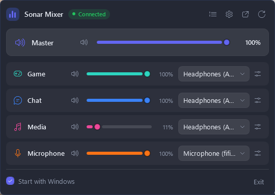
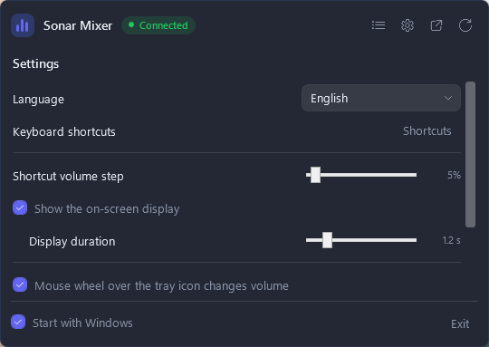
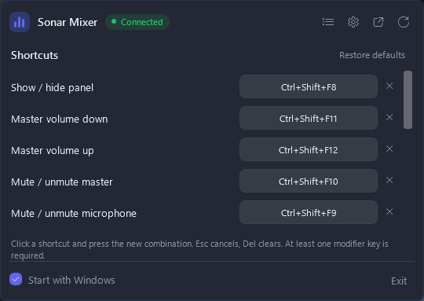
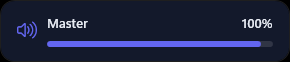

<div align="center">


# SonarTray

**Control the SteelSeries Sonar mixer from the notification area.**<br>
Volume, mute, device selection and global shortcuts, without opening the GG window.

[](https://github.com/emirakinc/SonarTray/releases/latest)
[](https://github.com/emirakinc/SonarTray/actions/workflows/ci.yml)
[](https://github.com/emirakinc/SonarTray/releases)
[](LICENSE)

<br>



<sub>[Türkçe](README.md)</sub>

</div>

<br>

## What it does

- **Right-click** → a compact mixer: volume, mute and output/input device for Master, Game, Chat,
  Media and Mic
- **Left-click** → brings the SteelSeries GG window to the front, starting it if it is closed
- **Global shortcuts** → mute the microphone or change the volume without leaving a game, with
  optional per-channel shortcuts for Game, Chat and Media
- **Mouse wheel over the tray icon** changes the master volume
- **Audio profiles** → switch Sonar's EQ and effect presets per channel
- **Presets** → save the whole mixer (volumes, mutes, routing) and recall it by name
- **Start with Windows** (an HKCU Run entry) and **Exit** from the panel
- **Reconnects by itself** when GG restarts and changes its ports
- The tray icon is drawn from the master volume and redrawn when the display scale changes
- **English and Turkish**, following the system language unless you choose otherwise

## Screenshots

<table>
<tr>
<td width="50%" align="center">
  
  <br><sub><b>Settings</b> — language, volume step, on-screen display, tray wheel, update check</sub>
</td>
<td width="50%" align="center">
  
  <br><sub><b>Shortcuts</b> — reassigned from the panel; a row is marked when another application already owns the combination</sub>
</td>
</tr>
<tr>
<td colspan="2" align="center">
  <br>
  
  <br><br><sub><b>On-screen display</b> — appears briefly when a shortcut fires</sub>
</td>
</tr>
</table>

## Install

### winget

```powershell
winget install emirakinc.SonarTray
```

### Scoop

```powershell
scoop install sonartray
```

### Manually

Latest release: **[Releases](https://github.com/emirakinc/SonarTray/releases/latest)**

| Package | For |
|---|---|
| `SonarTray-vX.Y.Z-win-x64.zip` | People who have the [.NET 8 Desktop Runtime](https://dotnet.microsoft.com/download/dotnet/8.0/runtime) (~130 KB) |
| `SonarTray-vX.Y.Z-win-x64-self-contained.zip` | People who would rather not install a runtime; stands alone (~58 MB) |

Unzip, copy `SonarTray.exe` to `%LOCALAPPDATA%\Programs\SonarTray\` and run it. There is no
installer; to remove it, delete the exe and the `%LOCALAPPDATA%\SonarTray\` folder.

The package is not signed, so SmartScreen may call it an unknown publisher: **More info → Run
anyway**. You can check the zip you downloaded against `SHA256SUMS.txt` in the release:

```powershell
Get-FileHash .\SonarTray-v0.1.0-win-x64.zip -Algorithm SHA256
```

## Using it

Windows 11 puts new tray icons in the `^` (hidden icons) menu by default; drag the icon onto the
taskbar to keep it visible.

Default shortcuts — all reassignable from the panel:

| Shortcut | What it does |
|---|---|
| `Ctrl+Shift+F8` | Show / hide the panel |
| `Ctrl+Shift+F9` | Mute / unmute the microphone |
| `Ctrl+Shift+F10` | Mute / unmute the master |
| `Ctrl+Shift+F11` | Master volume down (5%) |
| `Ctrl+Shift+F12` | Master volume up (5%) |

Per-channel shortcuts for Game, Chat and Media exist but ship **unbound** — five combinations are
enough to claim by default. Assign them from the shortcuts page.

Settings and logs: `%LOCALAPPDATA%\SonarTray\`

- `settings.json` — language, on-screen display, tray wheel, update check
- `hotkeys.json` — shortcut bindings, hand-editable
- `presets.json` — saved mixer snapshots
- `sonartray.log` — the last few runs

## Privacy

The only thing SonarTray talks to is Sonar's local API on `127.0.0.1`. The one exception is the
update check, which asks the GitHub releases API once a day whether a newer version exists. It
sends no identifier and nothing about you; switch it off in the settings if you would rather it
did not run.

## Development

```bash
dotnet build                  # or: dotnet build SonarTray.sln
dotnet test                   # 265 tests
dotnet run
dotnet run -- --smoke         # API smoke test; results in %LOCALAPPDATA%\SonarTray\sonartray.log
dotnet run -- --probe         # re-derives the endpoint table in docs/sonar-api.md (read-only)
dotnet run -- --show          # open the panel at startup (--show-settings / --show-hotkeys / --show-osd)
dotnet run -- --verbose       # log every write request
dotnet publish -c Release     # bin\Release\net8.0-windows\win-x64\publish\SonarTray.exe
powershell -ExecutionPolicy Bypass -File tools\Make-Icon.ps1   # regenerate Assets\tray.ico
powershell -ExecutionPolicy Bypass -File tools\Capture-Screenshots.ps1 -Language en   # docs\*.png
python tools\Generate-Strings.py                               # regenerate Resources\Strings*
```

Every push and PR runs the `ci` workflow: format check, Release build (`-warnaserror`), the test
suite, and `SonarTray.exe` uploaded to the run's **Artifacts** so it can be tried without cutting
a tag.

### UI strings

Both languages come from one table in [`tools/Generate-Strings.py`](tools/Generate-Strings.py),
which writes `Resources/Strings.resx`, `Resources/Strings_tr.resx` and the `Strings` accessor.
Add a key there and regenerate; a test fails if the two languages ever stop matching.

They are embedded in the main assembly rather than shipped as a culture satellite, because
satellite assemblies are **not** bundled into a `PublishSingleFile` exe — the Turkish strings
would silently disappear from the release build.

### Releasing

The version comes from the tag; the `release` workflow builds both packages, creates the GitHub
release and attaches the checksums.

```bash
# 1) turn the "Unreleased" heading in CHANGELOG.md into the new version, update <Version> in the
#    csproj, and commit
# 2) push the tag
git tag -a v0.1.0 -m "SonarTray v0.1.0"
git push origin v0.1.0
```

A tag like `v0.2.0-beta.1` is enough for a pre-release; the workflow marks it as one
automatically. Package manifests under [`packaging/`](packaging/) need their version and checksum
updated per release — see [packaging/README.md](packaging/README.md).

## How it works

Sonar's local REST API is unofficial. The discovery chain:

```
C:\ProgramData\SteelSeries\GG\coreProps.json
  └─ ggEncryptedAddress → https://127.0.0.1:{port}/subApps
       └─ subApps.sonar.metadata.webServerAddress → the mixer endpoints
```

Every endpoint lives in `Services/SonarClient.cs`, so a GG update that moves a route is a one-file
fix. The full map — including what is verifiably *not* there — is in
[docs/sonar-api.md](docs/sonar-api.md), and `--probe` regenerates it.

| Folder | Contents |
|---|---|
| `Services/` | discovery, HTTP client, connection state machine, settings, presets, startup entry, update check |
| `ViewModels/` | panel, channel row, settings and preset logic (debounce, sync guards) |
| `Views/` | popup window, channel row, settings and shortcut pages, on-screen display |
| `Hotkeys/` | global shortcut registration and assignment |
| `Tray/` | NotifyIcon, the icon drawn at runtime, and the mouse-wheel hook |
| `Converters/` | value converters used by the XAML |
| `Resources/` | the generated string tables |
| `Themes/Dark.xaml` | dark theme and control styles |
| `tests/` | the test suite |

## Licence

[MIT](LICENSE) — not affiliated with SteelSeries, and not an official product.
