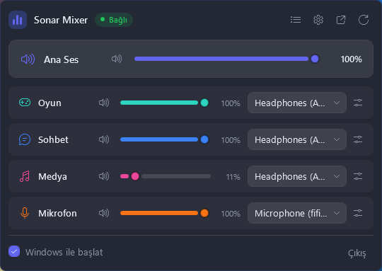
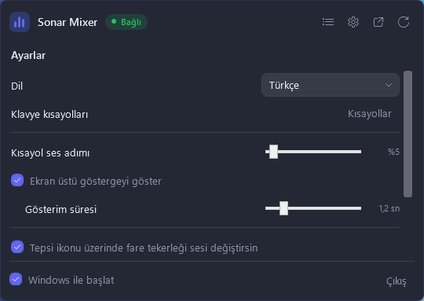
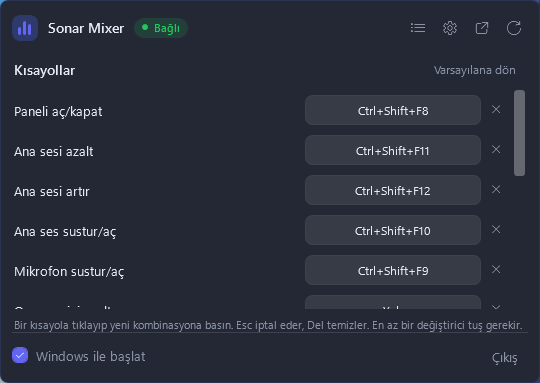
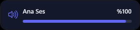

<div align="center">


# SonarTray

**SteelSeries Sonar mikserini bildirim alanından yönet.**<br>
GG penceresini açmadan ses, mute, cihaz seçimi ve global kısayollar.

[](https://github.com/emirakinc/SonarTray/releases/latest)
[](https://github.com/emirakinc/SonarTray/actions/workflows/ci.yml)
[](https://github.com/emirakinc/SonarTray/releases)
[](LICENSE)

<br>



<sub>[English](README.en.md)</sub>

</div>

<br>

## Ne yapar

- **Sağ tık** → kompakt mikser: Master / Game / Chat / Media / Mic için ses, mute ve çıkış/giriş
  cihazı seçimi
- **Sol tık** → SteelSeries GG penceresini öne getirir, kapalıysa başlatır
- **Global kısayollar** → oyundan çıkmadan mikrofonu sustur, ana sesi değiştir, paneli aç;
  Oyun/Sohbet/Medya için ayrı kısayollar da atanabilir
- **Tepsi ikonu üzerinde fare tekerleği** ana sesi değiştirir
- **Ses profilleri** → Sonar'ın EQ ve efekt ön ayarlarını kanal kanal değiştir
- **Ön ayarlar** → tüm mikseri (ses, mute, yönlendirme) kaydet, adıyla geri yükle
- **Windows ile başlat** tiki (HKCU Run kaydı) ve panelden **Çıkış**
- GG kapanıp açıldığında portlar değişse bile **kendiliğinden yeniden bağlanır**
- Tepsi ikonu ses seviyesine göre çizilir ve ekran ölçeği değişince yeniden üretilir
- **Türkçe ve İngilizce** — aksini seçmezsen sistem dilini izler

## Ekran görüntüleri

<table>
<tr>
<td width="50%" align="center">
  
  <br><sub><b>Ayarlar</b> — dil, ses adımı, ekran üstü gösterge, tepsi tekerleği, güncelleme kontrolü</sub>
</td>
<td width="50%" align="center">
  
  <br><sub><b>Kısayollar</b> — panelden yeniden atanır; kombinasyonu başka uygulama kapmışsa satır işaretlenir</sub>
</td>
</tr>
<tr>
<td colspan="2" align="center">
  <br>
  
  <br><br><sub><b>Ekran üstü gösterge</b> — kısayola bastığında kısa süre görünür</sub>
</td>
</tr>
</table>

## Kurulum

### winget

```powershell
winget install emirakinc.SonarTray
```

### Scoop

```powershell
scoop install sonartray
```

### Elle

Son sürüm: **[Releases](https://github.com/emirakinc/SonarTray/releases/latest)**

| Paket | Kime |
|---|---|
| `SonarTray-vX.Y.Z-win-x64.zip` | [.NET 8 Desktop Runtime](https://dotnet.microsoft.com/download/dotnet/8.0/runtime) kurulu olanlar (~130 KB) |
| `SonarTray-vX.Y.Z-win-x64-self-contained.zip` | Runtime kurmak istemeyenler; tek başına çalışır (~58 MB) |

Zip'i aç, `SonarTray.exe`'yi `%LOCALAPPDATA%\Programs\SonarTray\` altına kopyala ve çalıştır. Kurulum
sihirbazı yok; kaldırmak için exe'yi ve `%LOCALAPPDATA%\SonarTray\` klasörünü silmek yeterli.

Paket imzalı olmadığı için SmartScreen "bilinmeyen yayıncı" diyebilir: **Daha fazla bilgi → Yine de
çalıştır**. İstersen indirdiğin zip'i release'teki `SHA256SUMS.txt` ile karşılaştır:

```powershell
Get-FileHash .\SonarTray-v0.1.0-win-x64.zip -Algorithm SHA256
```

## Kullanım

Windows 11 yeni tray ikonlarını varsayılan olarak `^` (gizli simgeler) menüsüne koyar; ikonu görev
çubuğuna sürükleyerek kalıcı olarak görünür yapabilirsin.

Varsayılan kısayollar — hepsi panelden değiştirilebilir:

| Kısayol | Ne yapar |
|---|---|
| `Ctrl+Shift+F8` | Paneli aç / kapat |
| `Ctrl+Shift+F9` | Mikrofonu sustur / aç |
| `Ctrl+Shift+F10` | Ana sesi sustur / aç |
| `Ctrl+Shift+F11` | Ana sesi azalt (%5) |
| `Ctrl+Shift+F12` | Ana sesi artır (%5) |

Oyun / Sohbet / Medya için de kısayollar var ama **atanmamış geliyor** — varsayılan olarak beş
kombinasyon kapmak yeterli. Kısayollar sayfasından atayabilirsin.

Ayarlar ve log: `%LOCALAPPDATA%\SonarTray\`

- `settings.json` — dil, ekran üstü gösterge, tepsi tekerleği, güncelleme kontrolü
- `hotkeys.json` — kısayol atamaları, elle düzenlenebilir
- `presets.json` — kaydedilmiş mikser ön ayarları
- `sonartray.log` — son birkaç çalıştırma

## Gizlilik

SonarTray yalnızca `127.0.0.1` üzerindeki yerel Sonar API'siyle konuşur. Tek istisna güncelleme
kontrolüdür: günde bir kez GitHub releases API'sine yeni sürüm olup olmadığını sorar. Hiçbir
tanımlayıcı ya da kişisel veri göndermez; istemezsen ayarlardan kapatabilirsin.

## Geliştirme

```bash
dotnet build                  # ya da: dotnet build SonarTray.sln
dotnet test                   # 265 test
dotnet run
dotnet run -- --smoke         # API duman testi; sonuç %LOCALAPPDATA%\SonarTray\sonartray.log
dotnet run -- --probe         # docs/sonar-api.md'deki uç nokta tablosunu yeniden üretir (salt okunur)
dotnet run -- --show          # paneli açılışta göster (--show-settings / --show-hotkeys / --show-osd)
dotnet run -- --verbose       # her yazma isteğini logla
dotnet publish -c Release     # bin\Release\net8.0-windows\win-x64\publish\SonarTray.exe
powershell -ExecutionPolicy Bypass -File tools\Make-Icon.ps1   # Assets\tray.ico'yu yeniden üret
powershell -ExecutionPolicy Bypass -File tools\Capture-Screenshots.ps1 -Language tr   # docs\*.png
python tools\Generate-Strings.py                               # Resources\Strings* dosyalarını üret
```

Her push ve PR'da `ci` iş akışı: format denetimi, Release derlemesi (`-warnaserror`), test paketi ve
`SonarTray.exe`'yi çalıştırmanın **Artifacts** bölümüne koyma — etiket çıkarmadan denemek için.

### Arayüz metinleri

İki dil de tek bir tablodan geliyor: [`tools/Generate-Strings.py`](tools/Generate-Strings.py).
Betik `Resources/Strings.resx`, `Resources/Strings_tr.resx` ve `Strings` erişimcisini üretir.
Yeni anahtarı oraya ekleyip yeniden üret; iki dil birbirinden ayrışırsa test düşer.

Metinler uydu (satellite) derlemesi olarak değil, ana derlemeye **gömülü** tutuluyor: uydu
derlemeleri `PublishSingleFile` exe'sine dahil edilmiyor ve Türkçe metinler yayınlanan sürümden
sessizce kaybolurdu.

### Sürüm çıkarma

Sürüm numarası etiketten gelir; `release` iş akışı iki paketi de derleyip GitHub Release'i kendisi
oluşturur, sağlama toplamlarını ekler.

```bash
# 1) CHANGELOG.md'de "Yayımlanmadı" başlığını yeni sürüme çevir, csproj'daki <Version>'ı güncelle, commit'le
# 2) etiketi at
git tag -a v0.1.0 -m "SonarTray v0.1.0"
git push origin v0.1.0
```

Ön sürüm için `v0.2.0-beta.1` gibi bir etiket yeterli; iş akışı release'i otomatik olarak
*pre-release* işaretler. [`packaging/`](packaging/) altındaki paket manifestlerinin sürüm ve
sağlama toplamı her yayında güncellenmeli — bkz. [packaging/README.md](packaging/README.md).

## Nasıl çalışıyor

Sonar'ın yerel REST API'si resmi değildir. Keşif zinciri:

```
C:\ProgramData\SteelSeries\GG\coreProps.json
  └─ ggEncryptedAddress → https://127.0.0.1:{port}/subApps
       └─ subApps.sonar.metadata.webServerAddress → mikser uç noktaları
```

Tüm uç noktalar `Services/SonarClient.cs` içindedir; GG güncellemesiyle bir rota değişirse tek
dosyalık düzeltme. Tam harita — ve neyin **olmadığı** — [docs/sonar-api.md](docs/sonar-api.md)
dosyasında; `--probe` onu yeniden üretir.

| Klasör | İçerik |
|---|---|
| `Services/` | keşif, HTTP istemcisi, bağlantı durum makinesi, ayarlar, ön ayarlar, başlangıç kaydı, güncelleme kontrolü |
| `ViewModels/` | panel, kanal satırı, ayarlar ve ön ayar mantığı (debounce, senkron koruması) |
| `Views/` | popup penceresi, kanal satırı, ayarlar ve kısayol sayfaları, ekran üstü gösterge |
| `Hotkeys/` | global kısayol kaydı ve atama |
| `Tray/` | NotifyIcon, çalışma zamanında çizilen ikon, fare tekerleği kancası |
| `Converters/` | XAML'in kullandığı değer dönüştürücüler |
| `Resources/` | üretilen metin tabloları |
| `Themes/Dark.xaml` | koyu tema ve kontrol stilleri |
| `tests/` | test paketi |

## Lisans

[MIT](LICENSE) — SteelSeries ile bir ilgisi yoktur, resmi bir ürün değildir.
